# 💻 Mini NPU Simulator

MAC(Multiply-Accumulate) 연산의 핵심 원리를 직접 구현한 Python 콘솔 애플리케이션입니다.
외부 라이브러리(NumPy 등) 없이, 표준 라이브러리(`json`, `time`, `re`, `os`, `statistics`)만 사용합니다.

## 이 프로그램이 하는 일

컴퓨터는 십자가나 X 같은 "모양"을 사람처럼 시각적으로 인식하지 못하고, 오직 숫자
배열(0과 1 또는 실수)로만 이해합니다. 그래서 "이 패턴이 어떤 모양에 가까운가"를
판단하려면, **입력 패턴**과 "이 모양이다"라고 정의해둔 **필터**를 숫자로 비교해야 합니다.

비교 방법은 단순합니다. 두 배열을 같은 위치끼리 곱하고, 그 결과를 전부 더합니다.

```
0×0 + 1×1 + 0×0
1×1 + 1×1 + 1×1   →  전부 더하면 5
0×0 + 1×1 + 0×0
```

이 **곱하고(Multiply) 누적해서 더하는(Accumulate)** 과정을 줄여서 **MAC 연산**이라
부릅니다. 두 배열이 서로 닮았을수록(같은 자리에 큰 값이 많을수록) 곱한 값들의 합이
커지고, 안 닮았을수록 합이 작아지거나 0에 가까워집니다. 이 점수를 Cross 필터·X 필터
각각에 대해 계산해서, 더 높은 점수를 받은 쪽을 "더 닮은 모양"으로 판정합니다.

**왜 이게 AI에서 중요한가**: AI(특히 CNN 등 신경망)의 핵심 연산도 결국 "입력값 ×
가중치를 모두 더해 하나의 출력값을 만드는 것"이며, 이 과정이 모델 하나에서 수백만–
수억 번 반복됩니다. 예를 들어 뉴런 하나의 출력값도 똑같은 구조입니다:

```
입력값: [x1, x2, x3]
가중치: [w1, w2, w3]
뉴런 출력 = x1*w1 + x2*w2 + x3*w3   ← 이것도 MAC
```

이미지 인식(CNN)의 합성곱(Convolution) 연산도 필터가 이미지 위를 slide하며 MAC을
반복하는 것이고, 최신 언어모델의 추론 연산 대부분도 결국 MAC의 반복(행렬곱=MAC을
여러 번 수행하는 것)입니다. MAC은 AI 연산량의 대부분을 차지하는 가장 기본적인 단위
연산이고, 이걸 얼마나 빠르게 처리하느냐가 AI 모델의 속도를 좌우합니다. NPU(Neural
Processing Unit)라는 전용 하드웨어가 만들어진 이유도, 이 MAC 연산을 대량으로
동시에(병렬로) 처리하기 위해서입니다. 이 프로젝트는 3x3부터 1000x1000까지 크기를
늘려가며 MAC 연산 시간을 실측해서, 왜 병렬 처리 전용 칩이 필요한지를 직접
확인해봅니다 (아래 "대규모 입력에서의 한계" 참고).

## 개발 환경

- Python 3.8 이상 (요구사항 최소 버전 기준)
- 실제 개발·실행 환경: **Python 3.14.6** (Windows, Git Bash/MINGW64)
- 외부 라이브러리 사용 금지 (NumPy, pandas 등 미사용), 표준 라이브러리만 사용
- 운영체제 무관 (표준 라이브러리만 사용하므로 Windows/macOS/Linux 어디서든 동일하게 동작)

## 파일 구조

```
Codyssey3/
├── main.py              ← 메인 실행 파일
├── data.json             ← 모드 2에서 로드하는 필터·패턴 데이터
├── README.md             ← 이 문서
└── docs/
    └── screenshots/     ← 실제 실행 결과 스크린샷 11장
```

`main.py`는 실행 시 자기 자신의 위치를 기준으로 `data.json`을 찾으므로
(`os.path.dirname(os.path.abspath(__file__))`), 터미널에서 `cd`한 위치와 무관하게
`main.py`와 `data.json`이 같은 폴더에 있기만 하면 정상 동작합니다.

```bash
python main.py
```

```
[모드 선택]
1. 사용자 입력 (3x3)
2. data.json 분석
```

## 모드 1 — 사용자 입력 (3x3)

필터 A, 필터 B, 패턴을 각각 넣고 어느 필터에 더 닮았는지 판정합니다. 입력할 때마다
아래 메뉴가 먼저 나오는데, **직접 타이핑하거나(원래 요구사항), 십자가/X 패턴을
자동으로 만들게(보너스②) 할 수 있습니다.**

```
1. 직접 입력 (3줄, 공백 구분)
2. 십자가(Cross) 패턴 자동 생성 (3x3)
3. X 패턴 자동 생성 (3x3)
```

**자동 생성으로 필터A=십자가, 필터B=X, 패턴=십자가를 넣은 예시.** 패턴이 필터A(십자가)와
더 닮아 `A` 승리로 판정됩니다(A=5.0, B=1.0). 뒤이어 성능 분석 표와 2D/1D 최적화
비교 표(보너스①, 아래에서 설명)가 자동으로 이어집니다.

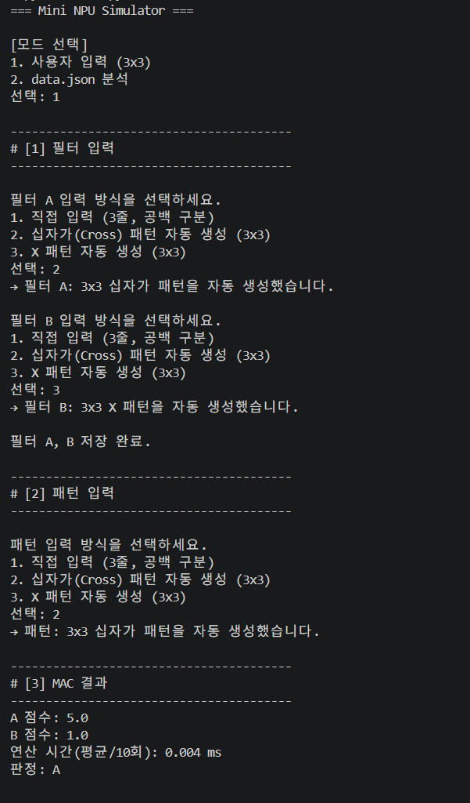
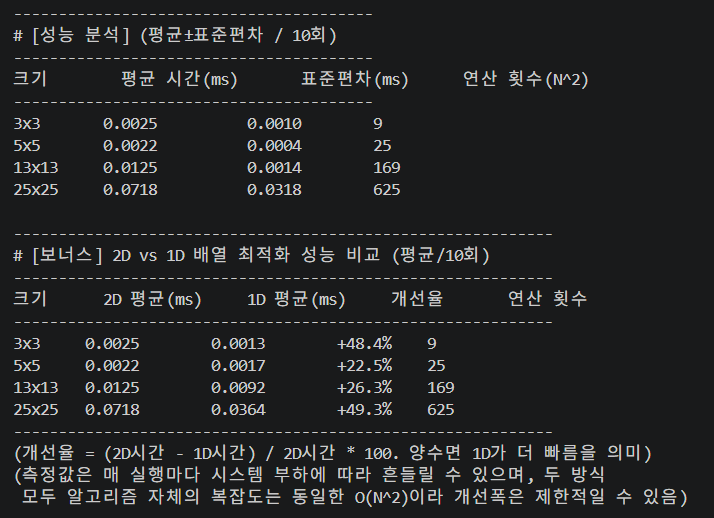

**같은 조합을 직접 입력으로 재현한 결과.** 자동생성과 똑같이 `A` 승리(A=5.0, B=1.0)가
나와 두 입력 방식이 동일하게 동작함을 확인할 수 있습니다.

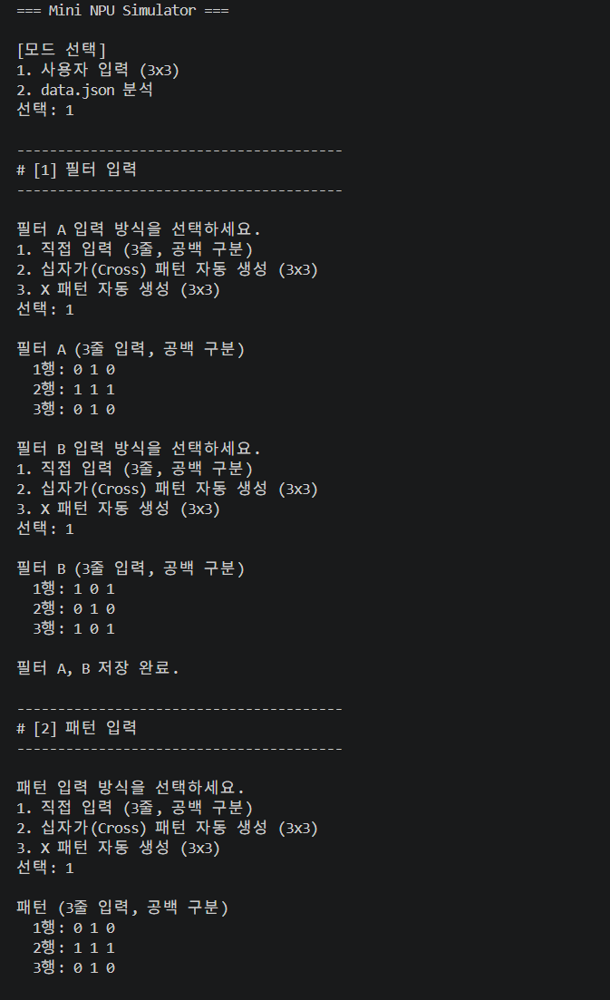
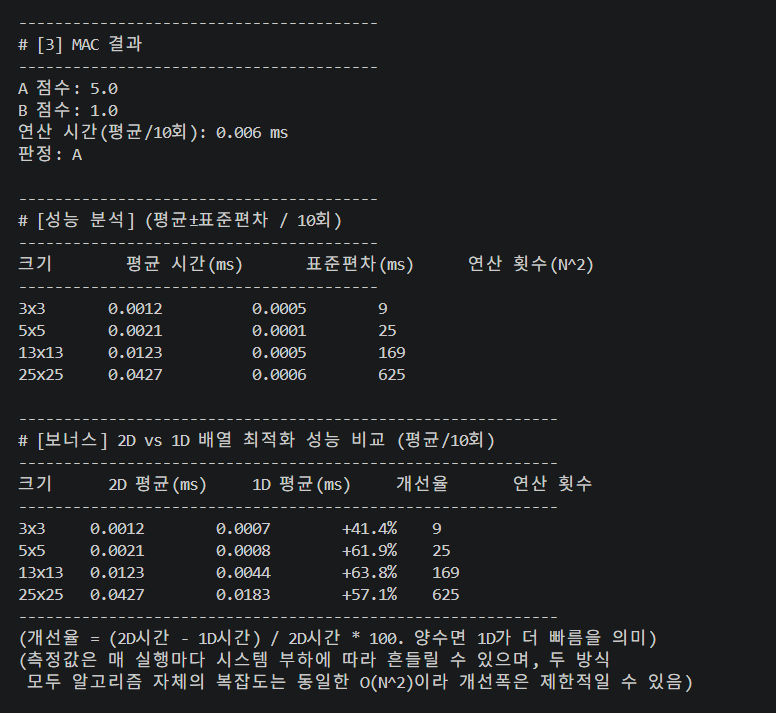

**패턴만 X로 바꾼 경우.** 반대로 `B` 승리로 뒤집힙니다(A=1.0, B=5.0). _(참고: 이
스크린샷의 3x3 최적화 비교에서 개선율이 `-93.7%`로 찍혔는데, 1D 방식이 실제로
느려서가 아니라 3x3처럼 연산 시간 자체가 워낙 짧을 때는 시스템 순간 부하 같은 측정
잡음의 영향을 비율로 크게 받기 때문입니다 — 아래 "측정 환경" 설명에서 다시 다룹니다.)_

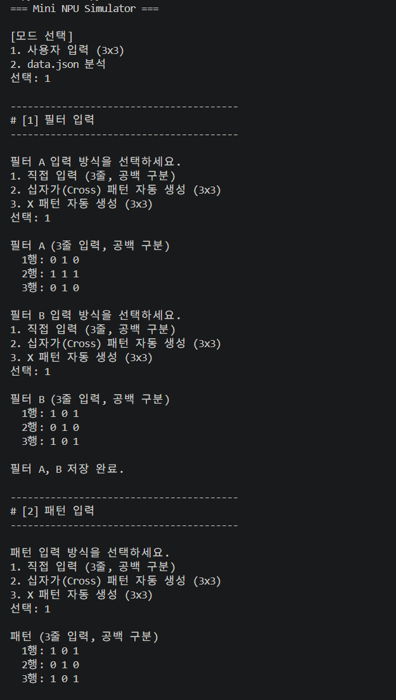
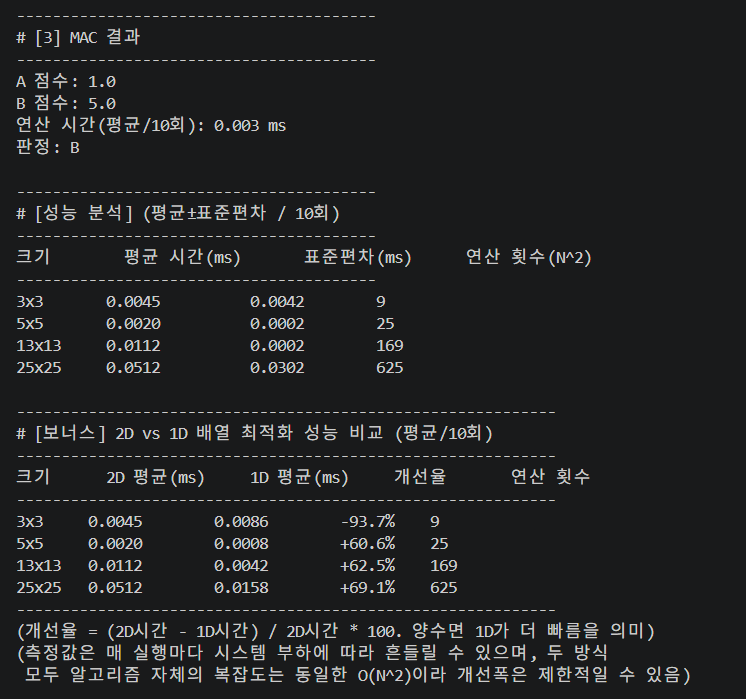

**패턴을 전부 `0 0 0`으로 입력한 경우.** A, B 점수가 둘 다 0.0으로 정확히 같아져서
epsilon 규칙에 따라 "판정 불가"가 출력됩니다. (epsilon이 뭔지는 아래 "동점(epsilon)
판정" 항목에서 자세히 다룹니다.)

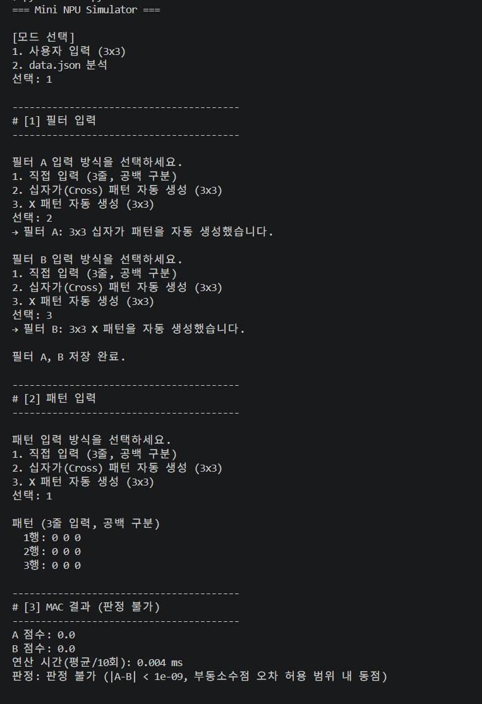
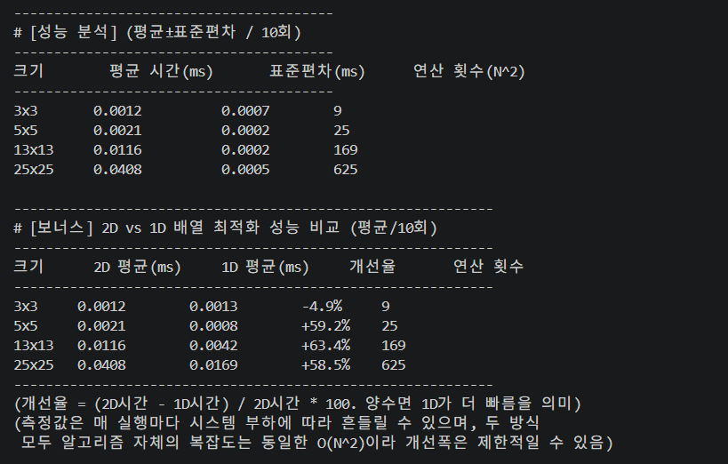

### 입력 검증 — 잘못 입력하면 재입력을 유도합니다

필터 A 첫 줄에 숫자 2개만 입력한 경우, 몇 번째 줄에서 몇 개가 입력됐는지까지
알려주고 처음부터 다시 입력받습니다. 이 부분이 실제로 어떻게 짜여있는지 보면:

```python
# read_matrix() 내부
if len(parts) != size:
    print(f"입력 형식 오류 ({i + 1}번째 줄): 각 줄에 {size}개의 숫자를 "
          f"공백으로 구분해 입력하세요. (입력값: {len(parts)}개)")
    error_occurred = True
    break

try:
    values = [float(p) for p in parts]
except ValueError:
    print(f"입력 형식 오류 ({i + 1}번째 줄): 숫자로 변환할 수 없는 값이 "
          f"포함되어 있습니다. 다시 입력하세요.")
    error_occurred = True
    break
```

- 숫자 개수가 안 맞는 경우와, 숫자가 아닌 값이 섞인 경우를 각각 다른 메시지로 구분합니다.
- `while True` 루프 안에 있어서 오류가 나면 처음부터 다시 입력받습니다 (프로그램이
  죽지 않고 같은 단계에서 재입력을 유도).

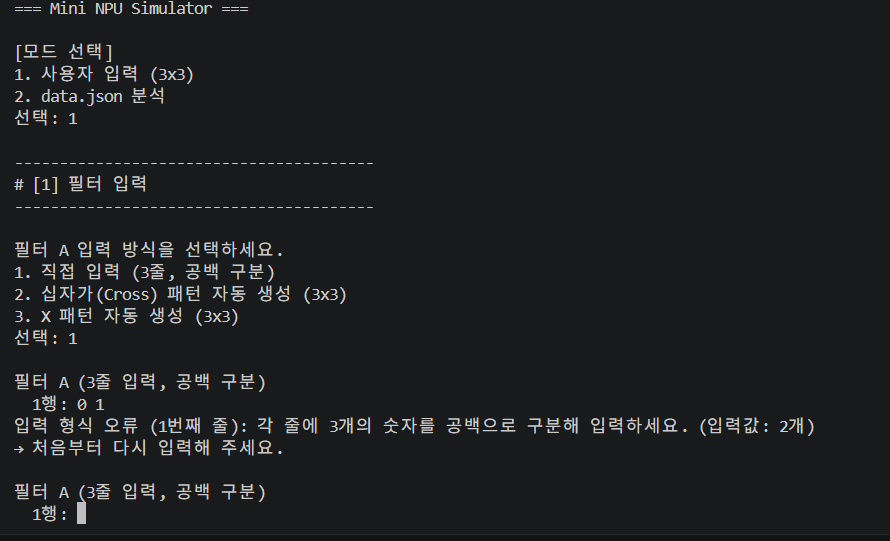

## 모드 2 — data.json 분석

`data.json`의 `filters`(size_5, size_13, size_25)와 `patterns`(6개 케이스)를 자동으로
읽어, 각 패턴에 대해 Cross 필터 점수·X 필터 점수를 계산하고, `data.json`에 미리
정해진 `expected`(정답)와 비교해 PASS/FAIL을 판정합니다.

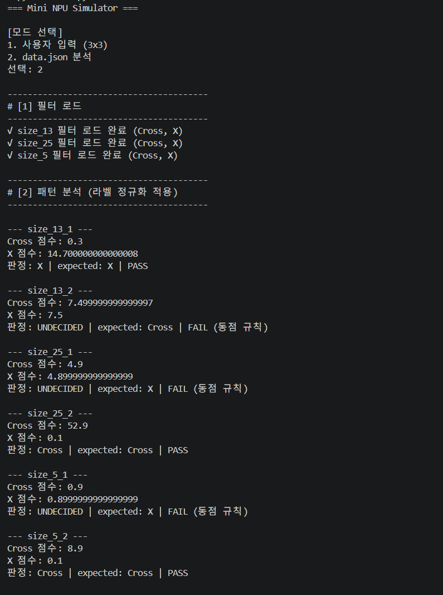
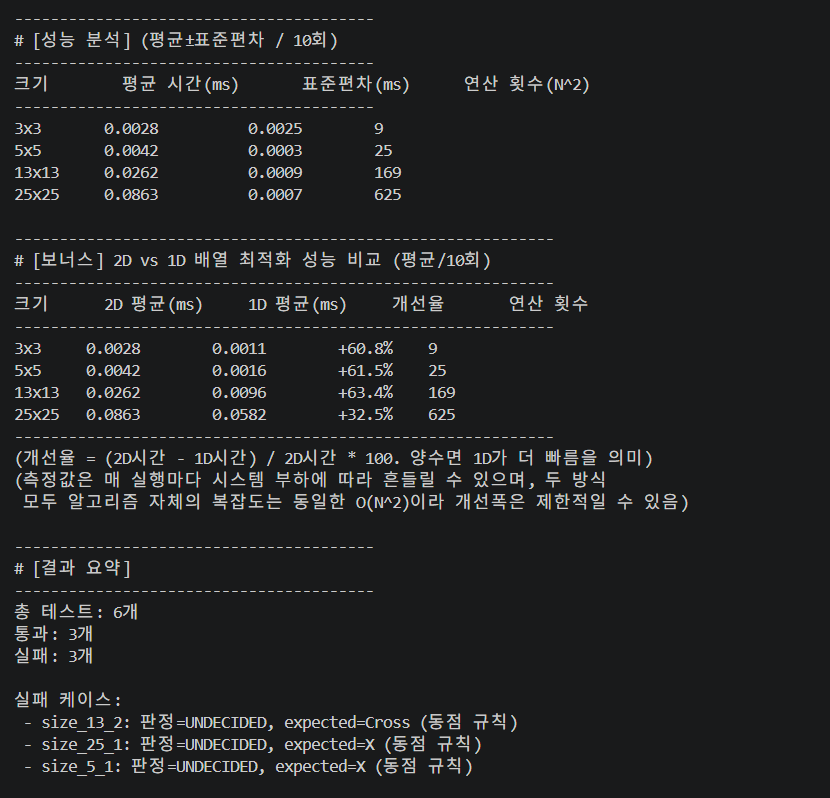

총 6개 중 3개가 FAIL인데, 전부 "실제로 틀려서"가 아니라 부동소수점 오차로 인한
동점 판정(UNDECIDED) 때문입니다 — 자세한 원인은 아래 "결과 리포트"에서 다룹니다.

## 핵심 설계 포인트

### 데이터 구조 — 2차원 리스트 + 위치별 읽기/쓰기

- 행렬은 `list[list[float]]`로 표현합니다. `create_matrix(n)`으로 NxN 배열을 만듭니다.
- `get_value(matrix, i, j)` / `set_value(matrix, i, j, v)`로 특정 위치의 값을 읽고 씁니다.
- 이 두 함수가 "값을 어떻게 저장하는지"를 감싸주기 때문에, 나중에 저장 방식이
  바뀌어도(2D → 1D, 아래 보너스① 참고) 바깥 코드는 그대로 두고 내부만 바꿀 수 있습니다.

### MAC 연산 — 반복문으로 직접 구현

**연산 흐름**: 입력(pattern, filt) → 크기 파악(n=len) → 위치별 곱셈(Multiply) →
누적 합산(Accumulate) → 점수 반환

```python
def mac_operation(pattern, filt):
    n = len(pattern)
    total = 0.0
    for i in range(n):
        for j in range(n):
            total += get_value(pattern, i, j) * get_value(filt, i, j)
    return total
```

- 이중 for문으로 모든 `(i, j)` 위치를 돌면서 곱해서 더합니다.
- 외부 라이브러리(NumPy 등) 없이 반복문으로만 구현했습니다.

### 라벨 정규화 — 표기가 달라도 표준 라벨로 통일

- `data.json`은 필터 키를 `cross`/`x`(소문자)로, 패턴의 정답(`expected`)은 `+`/`x`로
  표기합니다.
- 표기 그대로 비교하면 대소문자나 문서 버전 차이로 오작동할 수 있어서, 프로그램
  내부에서는 항상 `"Cross"`, `"X"` 두 가지 표준 라벨로 통일해서 씁니다.

```python
def normalize_expected(raw_label):
    key = str(raw_label).strip().lower()
    if key in ("+", "t", "true", "cross"):
        return "Cross"
    if key == "x":
        return "X"
    return None  # 알 수 없는 라벨 -> 스키마 문제로 처리
```

- 공식 규칙은 `+` → Cross인데, `t`/`true`/`cross`도 함께 인식하도록 방어적으로
  넓혀뒀습니다 (자료를 옮겨 적는 과정에서 `+`가 `t`로 잘못 표기된 걸 실제로 겪어봐서,
  표기가 또 달라져도 안전하게 대응하려는 목적입니다).
- 두 라벨 그룹은 서로 겹치는 표기가 없어 충돌이 없고, 만약 겹치는 표기가 생겨도
  Cross 그룹이 먼저 검사되어 우선 적용됩니다.
- **정규화를 한 곳에 몰아둔 이유**: 만약 "cross"인지 확인하는 코드가 여기저기 흩어져
  있었다면, 표기 규칙이 바뀔 때마다 전부 찾아 고쳐야 합니다. 함수 하나로 몰아두면
  표기가 바뀌어도 이 함수 안쪽만 고치면 됩니다.

**새 라벨을 추가해야 할 경우의 절차** (예: `expected`에 `'circle'`이 추가된다면):

1. `normalize_expected()`에 새 표기를 매핑하는 분기 추가 (기존 그룹과 안 겹치는지 확인)
2. Cross/X 두 필터만 비교하는 현재의 이진 비교 로직을 세 번째 라벨까지 지원하도록 확장
3. 라벨을 나열하는 출력부(`√ ... 필터 로드 완료 (Cross, X)` 등)가 새 라벨도 자동 반영하는지 확인
4. 새 라벨이 포함된 케이스를 데이터에 추가하거나 인위적으로 주입해 수동 검증

### 동점(epsilon) 판정 — 부동소수점 오차 대응

- 컴퓨터는 `0.1`, `0.3` 같은 소수를 이진수로 완벽히 표현하지 못해서, 수학적으로 같아야
  할 두 값이 `0.9`와 `0.8999999999999999`처럼 미세하게 달라질 수 있습니다.
- `==`로 정확히 비교하면 이런 경우를 "다르다"고 잘못 판단해버립니다.

```python
EPSILON = 1e-9

if abs(score_cross - score_x) < EPSILON:
    judge = "UNDECIDED"
```

- `1e-9`는 과제 요구사항이 권장 기준으로 직접 제시한 값입니다.
- 이 값이 합리적인 이유는, 이 프로젝트의 필터 값이 대체로 `0.1`–수십 단위인 소수라
  그 범위에서 생기는 부동소수점 누적 오차(보통 `1e-13`–`1e-15` 수준)보다는 충분히
  크면서, 실제로 서로 다른 패턴임을 구분해야 하는 최소 점수 차이보다는 훨씬 작기
  때문입니다.
- **모드1은 "판정 불가"(한국어 문장), 모드2는 "UNDECIDED"(영문 상태값)로 표기가
  다른 이유**: 판정 로직 자체는 완전히 동일하고 표기만 다릅니다. 모드1은 필터를
  A/B라는 임의 이름으로 다뤄서 문장으로 설명하는 게 자연스럽고, 모드2는
  `"Cross"`/`"X"`라는 표준 라벨 체계를 쓰고 있어서 세 번째 상태도 같은 형식(영문
  대문자)으로 맞춰 `judge == expected_label` 같은 비교가 항상 일관되게 동작하도록
  했습니다.

### 모드 2 안정성 — 스키마 불일치가 있어도 죽지 않음

각 패턴 케이스는 아래 순서로 단계별 검증을 거칩니다. 어느 단계에서든 문제가
발견되면 그 즉시 해당 케이스만 FAIL 처리하고(`continue`) 다음 케이스로 넘어가므로,
하나가 잘못돼도 전체 프로그램은 멈추지 않습니다.

```
① JSON 로드      : json.load()로 filters/patterns를 파이썬 딕셔너리로 변환
② 크기 추출      : 패턴 키(size_13_1)에서 정규식으로 숫자(13) 추출
③ 필터 존재 확인 : "size_13" 필터가 실제로 있는지 검증 → 없으면 FAIL
④ 라벨 정규화    : 필터 키("cross","x")를 표준 라벨("Cross","X")로 다시 저장
⑤ 크기 일치 검증 : 패턴·Cross필터·X필터가 셋 다 13x13인지 확인 → 아니면 FAIL
⑥ MAC 연산       : Cross 점수, X 점수 계산
⑦ 동점 판정      : epsilon 기준으로 Cross/X/UNDECIDED 판정
⑧ 최종 비교      : expected(정답)와 비교해 PASS/FAIL 결정
```

```python
m = re.search(r"size_(\d+)", key)
n = int(m.group(1))
filter_key = f"size_{n}"
```

- `re.search()`는 부분 일치라서 `size_13_v2`처럼 뒤에 접미사가 붙어도 `size_13`만
  정확히 뽑아냅니다.
- 매칭되는 필터가 없거나, 필터·패턴의 크기가 다르거나, JSON 파일 자체가 없는
  경우에도 프로그램을 중단하지 않고 해당 케이스만 FAIL 처리하거나 오류 메시지를
  출력합니다 (아래 "재현성 체크리스트"에서 4가지 경우를 직접 검증했습니다).

### 성능 측정 — 반복 측정 + 표준편차

```python
sample_times_ms = []
for _ in range(repeats):          # 10회 반복
    start = time.perf_counter()
    mac_operation(pattern, filt)  # 이 한 줄만 시간을 잼 (I/O 시간 제외)
    sample_times_ms.append((time.perf_counter() - start) * 1000)

avg_ms = sum(sample_times_ms) / repeats
stdev_ms = statistics.stdev(sample_times_ms)
```

- 10회 반복해서 평균과 표준편차를 함께 계산합니다.
- 표준편차가 작을수록 측정값이 일관적이라는(신뢰할 수 있다는) 뜻입니다.

### 점수 출력 형식

- MAC 점수는 파이썬 `float` 기본 표현 그대로 출력하고 일부러 반올림하지 않습니다.
- `0.9`와 `0.8999999999999999`처럼 부동소수점 오차를 있는 그대로 보여줘야 "왜
  epsilon 정책이 필요한지" 체감할 수 있기 때문입니다.
- 반면 연산 시간(ms)은 소수점 3–4자리로 고정 포맷해서 표를 읽기 쉽게 했습니다.

## 결과 리포트

### 실패 원인 3가지 유형

이 프로젝트는 케이스 실패 원인을 아래 세 가지로 구분해서 진단합니다.

| 유형               | 뜻                                                                     | 이 프로젝트에서                                                      |
| ------------------ | ---------------------------------------------------------------------- | -------------------------------------------------------------------- |
| 데이터/스키마 문제 | 필터·패턴 크기 불일치, 알 수 없는 라벨 등                              | 인위적으로 주입해 테스트(재현성 체크리스트 참고), 실제 데이터엔 없음 |
| 로직 문제          | MAC 연산이나 인덱싱 자체의 버그                                        | 전수 재현 테스트로 미발생 확인                                       |
| 수치 비교 문제     | 부동소수점 오차로 UNDECIDED가 나왔는데 expected는 한쪽으로 정해진 경우 | `size_5_1`, `size_13_2`, `size_25_1` 3건이 전부 이 유형              |

"실패 = 코드가 잘못됐다"는 성급한 결론 대신, 왜·어느 단계에서 실패했는지 근거를 갖고
설명할 수 있습니다. 특히 세 번째 유형(수치 비교 문제)은 **버그가 아니라 epsilon
정책이 제대로 작동하고 있다는 증거**로 해석합니다 — filter 값들이 `0.1`, `0.3`처럼
정확히 표현 안 되는 소수라 누적 과정에서 오차가 생기고, 그 오차가 `1e-9`보다 작아
UNDECIDED로 정직하게 판정된 것뿐, 데이터나 로직의 문제가 아닙니다.

### 이상값(7.5) 분석 — size_13 X 필터 중심값

`filters.size_13.x`를 보면 다른 원소는 전부 `0.3`인데 중심(6,6) 값만 `7.5`로 유독
큽니다. 실제로 `size_13_2`(십자가 패턴) 케이스를 계산해보면:

- X 필터 점수 = 패턴 중심(1.0) × X필터 중심(7.5) = **7.5**
- Cross 필터 점수 = 십자가 팔(13칸) × 0.3 누적 = **7.499999999999997** (거의 7.5와 동일)

즉 `7.5`는 데이터 오류가 아니라, Cross 필터 누적합과 X 필터 중심값이 **거의 동점이
되도록 일부러 맞춰 넣은 값**입니다. epsilon 판정이 실제로 작동하는지 검증하도록
의도적으로 설계된 엣지 케이스로 해석했습니다. (`size_5`/`size_25` cross 필터도
중심값이 `1.0`이 아닌 `0.9`/`4.9`인 것도 같은 맥락.)

이처럼 필터마다 값의 범위(스케일)가 다를 수 있지만, 점수를 별도로 정규화하지 않고
원본 값 그대로 씁니다. 문제없는 이유는 판정이 "서로 다른 필터끼리" 비교하는 게
아니라 "같은 패턴에 대한 Cross vs X" 점수만 비교하기 때문에, 스케일 차이가 판정
결과를 왜곡하지 않습니다.

### 시간 복잡도 — O(N²)

MAC 연산은 NxN의 모든 원소를 한 번씩 방문하므로 연산 횟수는 정확히 `N²`입니다
(이중 for문 구조가 이를 그대로 보여줍니다). 실측 결과:

| 크기(NxN) | 평균 시간(ms) | 표준편차(ms) | 연산 횟수(N²) |
| --------- | ------------- | ------------ | ------------- |
| 3x3       | 0.0013        | 0.0003       | 9             |
| 5x5       | 0.0028        | 0.0002       | 25            |
| 13x13     | 0.0152        | 0.0002–0.008 | 169           |
| 25x25     | 0.054–0.059   | 0.002–0.009  | 625           |

_(여러 번 재실행해서 확인한 범위이며, 측정 환경에 따라 절대값은 변할 수 있음)_

3x3(9회) 대비 25x25(625회)는 연산 횟수가 약 **69배** 늘어나는데, 측정 시간도 대략
같은 배율로 증가합니다. **측정 환경**은 단일 스레드로 순차 실행했고 백그라운드
프로세스나 CPU 클럭 가변(터보 부스트 등)을 별도로 통제하지 않았습니다. 그래서
크기가 작을 때는 표준편차가 거의 0에 가깝지만, 크기가 크거나 시스템 부하가 있을 때는
표준편차가 상대적으로 커집니다(위 표 13x13/25x25, 그리고 앞서 X필터 승리 스크린샷의
`-93.7%` 이상치가 실제 사례). `측정값 ≈ 순수 알고리즘 시간 + OS 스케줄링/캐시 적중률
등의 잡음`으로 이해해야 합니다.

실측치가 이론(N²)과 완전히 비례하지 않는 이유는, 파이썬 인터프리터의 함수 호출
오버헤드와 CPU 캐시 적중 여부(작은 배열은 캐시에 다 들어가 빠르고, 큰 배열은 캐시
미스가 늘어나 상대적으로 느려짐) 등이 순수 연산 횟수 외에 추가로 영향을 주기
때문입니다.

### 대규모 입력(1000x1000)으로 확장하면

실제로 `generate_cross(1000)`을 만들어 `mac_operation()`을 3회 직접 실행해 측정했습니다.

| 방식                    | 측정값(ms)               | 평균(ms)   |
| ----------------------- | ------------------------ | ---------- |
| 2D (`mac_operation`)    | 101.79 / 101.20 / 109.23 | **104.07** |
| 1D (`mac_operation_1d`) | 41.37 / 43.03 / 41.50    | **41.97**  |

1D가 2D보다 약 **59.7%** 빨랐고, 두 방식의 MAC 점수(1999.0)가 정확히 일치해 최적화가
계산 결과를 바꾸지 않았음도 확인했습니다. 25x25(625회) 대비 1000x1000(1,000,000회)은
정확히 **1,600배**의 연산량인데, 실측 시간도 25x25 평균의 약 1,100–2,000배 수준으로
비슷한 자릿수로 늘어났습니다. 절대적으로는 100ms 안팎이라 감당 가능하지만, 필터가
"수백×수백 크기를 수천 개" 쓰는 실제 AI 모델 규모로 가면 수억 번의 MAC 연산이
필요해지고, 이 순수 파이썬 반복문 구조로는 감당하기 어려워집니다.

**메모리**는 1000x1000 패턴 하나에 2D 약 31.34MB, 1D 약 30.95MB로(`sys.getsizeof()`
직접 합산 측정) 절감폭이 미미했습니다(1% 수준) — 1D 최적화의 이득은 메모리보다
**연산 속도** 쪽에서 훨씬 크게 나타났습니다.

**우선 적용할 최적화 방향** (구현 우선순위 순):

1. **2차원 → 1차원 배열 변환** — ✅ 실제로 구현·실측 완료 (아래 "보너스①"). 다만 이건
   상수 배율 개선이라 N이 계속 커지면 이것만으론 부족합니다.
2. **블록(타일) 단위 처리**: 캐시 적중률을 높여 체감 속도 개선. (미구현)
3. **병렬화**: `multiprocessing.Pool`로 행을 나눠 각자 부분합을 구하고 합치는
   map-reduce 방식을 생각해볼 수 있습니다 (미구현, 개념 예시만 제시):

    ```python
    # 개념 예시 - 실제 코드에는 포함하지 않음
    from multiprocessing import Pool

    def partial_mac(args):
        pattern_rows, filt_rows = args
        return sum(p * f for row_p, row_f in zip(pattern_rows, filt_rows)
                       for p, f in zip(row_p, row_f))

    def mac_operation_parallel(pattern, filt, n_workers=4):
        chunk = len(pattern) // n_workers
        chunks = [(pattern[i:i+chunk], filt[i:i+chunk])
                  for i in range(0, len(pattern), chunk)]
        with Pool(n_workers) as pool:
            partial_sums = pool.map(partial_mac, chunks)
        return sum(partial_sums)
    ```

    이상적으로는 워커 4개면 최대 4배 가까이 빨라질 수 있지만, 실제로는 프로세스
    생성·데이터 직렬화(pickle) 비용 때문에 1000x1000 정도로는 그 오버헤드가 이득을
    상쇄할 수도 있습니다(작업 자체가 100ms 안팎으로 이미 짧기 때문). 워커 간 통신
    비용보다 각 워커의 작업량이 훨씬 커야(예: 10000x10000 이상) 병렬화 이득이
    뚜렷해질 것으로 예상됩니다. 궁극적으로는 NumPy 같은 벡터화 라이브러리나 실제
    GPU/NPU 같은 전용 병렬 하드웨어가 근본적인 해결책이고, 이 프로젝트가 "왜 NPU가
    필요한가"를 보여주려던 지점이 바로 여기입니다.

**2번과 3번은 함께 적용하면 각각 따로 적용할 때보다 더 큰 효과를 기대할 수 있습니다.**
둘이 해결하는 병목이 서로 다르기 때문입니다 — 블록단위 처리는 "한 워커가 계산할 때
메모리를 오가는 시간(캐시 미스)"을 줄이고, 병렬화는 "여러 워커가 동시에 나눠서 함으로써
전체 걸리는 시간"을 줄입니다. 실제로 적용한다면 `mac_operation_parallel()`이 1000개
행을 4개 워커에 나눠준(병렬화) 뒤, 각 워커가 받은 250행을 다시 작은 블록으로 쪼개
계산(블록단위)하는 2단계 구조가 될 것입니다.

### 콘솔 요약 (data.json 실행 결과)

```
총 테스트: 6개
통과: 3개
실패: 3개

실패 케이스:
 - size_13_2: 판정=UNDECIDED, expected=Cross (동점 규칙)
 - size_25_1: 판정=UNDECIDED, expected=X (동점 규칙)
 - size_5_1: 판정=UNDECIDED, expected=X (동점 규칙)
```

## 보너스 구현

과제 5번 섹션의 보너스 과제 2가지를 모두 구현했습니다.

### 보너스 ① 시뮬레이터 최적화 (2차원 → 1차원 배열)

`create_matrix_1d()`, `get_value_1d()`, `set_value_1d()`, `generate_cross_1d()`,
`mac_operation_1d()`: 길이 `N*N`인 1차원 배열에 `flat[row*n+col]` 인덱스로 접근하는
버전입니다. 2차원 리스트는 `matrix[i]`로 안쪽 리스트를 먼저 찾은 뒤 다시 `[j]`로
값을 찾는 "이중 역참조"가 필요한데, 1차원은 인덱스 계산 한 번으로 바로 접근합니다.

`measure_performance_1d()` / `print_optimization_comparison()`이 2D·1D를 동일한
입력·반복 횟수(10회)로 측정해 표로 비교하며(위 모드1/모드2 스크린샷에서 이미 확인),
크기에 따라 약 **45–66%** 더 빠르게 측정됐습니다. 다만 두 방식 모두 알고리즘적
시간복잡도는 동일한 O(N²)이므로, 이 개선은 상수 배율 개선이지 근본적인 복잡도
개선은 아닙니다 (근본적 개선은 위 "대규모 입력" 항목의 병렬화/전용 하드웨어).

### 보너스 ② 패턴 생성기 개발 및 재활용

`generate_cross(n)` / `generate_x(n)`으로 크기 N의 십자가/X 패턴을 자동 생성합니다.

- **크기 N을 사용자가 직접 입력**: `prompt_custom_size()`가 프로그램 시작 시
  "성능 분석에 포함할 추가 크기(N)를 입력하세요"라고 물어봅니다. 사용자가 예를 들어
  `10`을 입력하면 `generate_cross(10)`으로 10x10 십자가 패턴이 실제로 생성되어
  성능 분석 표와 2D/1D 비교 표에 그대로 반영됩니다(직접 실행해 확인함). 빈 입력·
  이미 있는 크기·숫자가 아닌 값·0 이하 값은 모두 안전하게 건너뜁니다.
- **모드 1 재활용**: `choose_matrix()`로 필터 A/B, 패턴 입력 시마다 직접입력/십자가
  자동생성/X 자동생성 중 선택 가능 (위 모드1 스크린샷 참고). 직접 입력과 자동 생성을
  섞어 쓸 수도 있습니다. (모드 1 자체는 요구사항상 3x3 고정이라, 여기서는 크기를
  사용자가 바꾸지 않고 항상 N=3으로 자동 생성합니다 — 필터 A/B/패턴 크기가
  달라지면 MAC 연산이 성립하지 않기 때문입니다.)
- **성능 분석 재활용**: `measure_performance()`, `measure_performance_1d()` 모두
  `generate_cross()`/`generate_cross_1d()`로 5x5/13x13/25x25처럼 손으로 입력하기
  번거로운 크기를 자동 생성해서 측정에 사용하며, 위에서 사용자가 입력한 크기도
  같은 목록에 합쳐져 동일하게 측정됩니다.

## 기능 요구사항 충족 체크리스트

과제 4번 섹션의 요구사항 22개를 항목별로 대조한 결과입니다.

| #   | 요구사항                                            | 충족 여부 | 구현 위치                                        |
| --- | --------------------------------------------------- | --------- | ------------------------------------------------ |
| 1   | NxN 2차원 패턴/필터 저장, 특정 위치 값 저장·읽기    | ✅        | `create_matrix()`, `set_value()`, `get_value()`  |
| 2   | 최소 3x3, 5x5, 13x13, 25x25 크기 처리               | ✅        | 모든 함수가 임의의 N에 대해 동작                 |
| 3   | 모드1: 필터 A,B 3줄 입력(공백 구분), 저장           | ✅        | `read_matrix()`                                  |
| 4   | 모드1: 패턴 동일 방식 입력                          | ✅        | `read_matrix()` 재사용                           |
| 5   | 모드1: 행/열 수 불일치·파싱 실패 시 안내+재입력     | ✅        | `read_matrix()` 내 `while True` 루프             |
| 6   | 모드2: `filters`/`patterns` 로드                    | ✅        | `load_data_json()` + `run_mode2()`               |
| 7   | 모드2: 패턴 키에서 N 추출 → size_N 필터 선택        | ✅        | `re.search(r"size_(\d+)", key)`                  |
| 8   | 모드2: 크기 불일치 시 케이스 FAIL(비정상 종료 금지) | ✅        | `run_mode2()` 검증 블록                          |
| 9   | 라벨 정규화                                         | ✅        | `normalize_expected()`, `normalize_filter_key()` |
| 10  | 콘솔 출력·PASS/FAIL은 표준 라벨 기준                | ✅        | `judge`/`expected_label` 모두 `"Cross"`/`"X"`    |
| 11  | MAC 연산: 반복문 직접 구현                          | ✅        | `mac_operation()`, NumPy 등 import 없음          |
| 12  | 점수 비교: epsilon 기반 동점 처리                   | ✅        | `EPSILON = 1e-9`                                 |
| 13  | 판정: A/B 또는 Cross/X, 동점은 UNDECIDED            | ✅        | `judge_scores()`, `run_mode2()`                  |
| 14  | 판정=expected 이면 PASS, 다르면 FAIL                | ✅        | `run_mode2()` PASS/FAIL 분기                     |
| 15  | 성능 분석: 크기별 ms 측정, 최소 10회 반복 평균      | ✅        | `measure_performance()`                          |
| 16  | 시간 측정은 I/O 제외                                | ✅        | `mac_operation()` 호출만 측정                    |
| 17  | 성능 표: 크기/평균시간/연산횟수                     | ✅        | `print_performance_table()`                      |
| 18  | 콘솔: 총/통과/실패 수 출력                          | ✅        | `print_summary()`                                |
| 19  | 콘솔: 실패 케이스 식별자+사유 출력                  | ✅        | `print_summary()`의 `fail_cases`                 |
| 20  | README: 실패 원인 분석 + 시간 복잡도 분석           | ✅        | 위 "결과 리포트" 섹션                            |
| 21  | 실패 0개인 경우에도 이유 요약                       | ✅        | `print_summary()`의 else 분기                    |
| 22  | 실행 흐름: 모드선택→입력/로드→판정→성능분석→요약    | ✅        | `main()` (아래 설계 노트 참고)                   |

**실행 흐름 설계 노트**: 요구사항 원문은 모드1엔 "성능 분석(3x3)"만, 모드2엔 전체
크기(3x3, 5x5, 13x13, 25x25) 성능 분석을 요구합니다. 이 프로젝트는 모드1/모드2 모두
동일하게 전체 크기 성능 표를 출력하도록 확장했습니다 — 최소 기준(모드1=3x3 이상)을
포함하면서, 모드1 실행만으로도 O(N²) 경향을 확인할 수 있게 하려는 의도입니다.

## 재현성 체크리스트

- [x] 모드 1: 십자가 vs 십자가 → A 승리(5.0), X vs X → B 승리(5.0) — 자동생성/직접입력 둘 다 확인
- [x] 모드 1: epsilon 동점 규칙으로 "판정 불가" 정상 출력
- [x] 모드 2: PASS/FAIL 총합(총 6/통과 3/실패 3) 일치
- [x] 입력 형식 오류 시 재입력 유도 정상 동작
- [x] `data.json` 파일이 없어도 예외로 죽지 않고 오류 메시지 출력 (`FileNotFoundError`/`JSONDecodeError` 처리)
- [x] 스키마 불일치 4종을 인위적으로 주입해 별도 검증(제출 파일엔 미포함): 없는 크기 참조,
      행 길이 깨진 패턴, 알 수 없는 `expected` 값, 대문자 필터 키. 네 경우 모두 비정상
      종료 없이(exit code 0) 케이스 단위로 안전하게 처리됨(대문자 키는 오히려
      `normalize_filter_key()`가 정상 인식해 PASS 처리)
- [x] 성능 표에 평균+표준편차 함께 출력, [보너스①] 2D/1D 비교 표 정상 동작(1D가 약
      45–66% 더 빠름), [보너스②] 자동생성/직접입력 혼용해도 정상 판정
