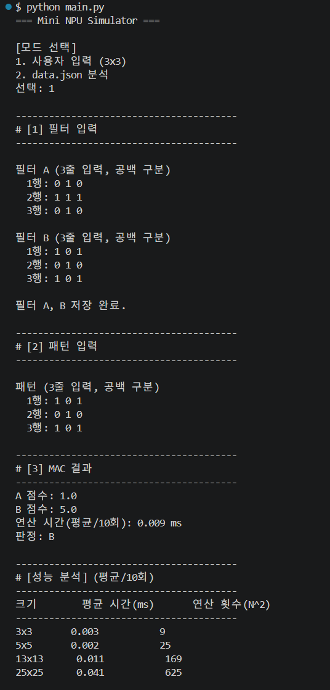
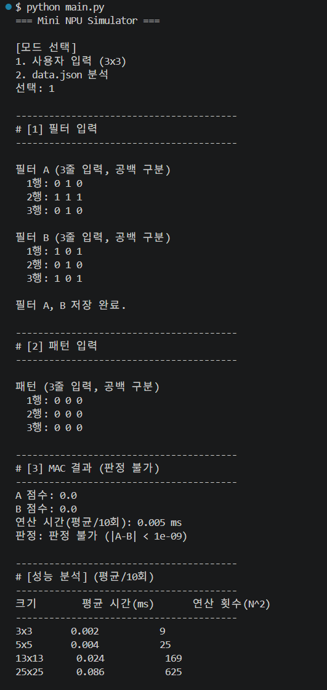
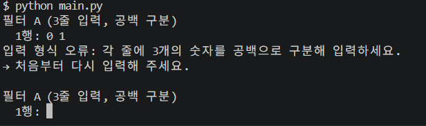
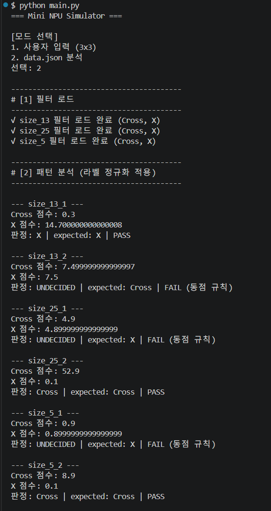
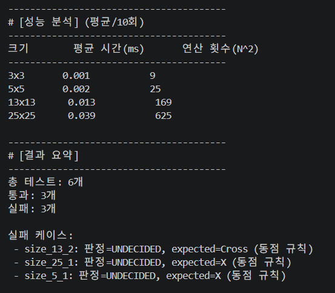

# Mini NPU Simulator

MAC(Multiply-Accumulate) 연산의 핵심 원리를 직접 구현한 Python 콘솔 애플리케이션입니다.
외부 라이브러리(NumPy 등) 없이, 표준 라이브러리(`json`, `time`, `re`, `os`)만 사용합니다.

## 개발 환경

- Python 3.8 이상
- 외부 라이브러리 사용 금지 (NumPy, pandas 등 미사용)
- 표준 라이브러리만 사용: `json`, `time`, `re`, `os`
- 운영체제 무관 (표준 라이브러리만 사용하므로 Windows/macOS/Linux 어디서든 동일하게 동작)

## 파일 구조

```
Codyssey3/              (프로젝트 루트)
├── main.py              ← 메인 실행 파일 (이 프로그램의 전체 로직)
├── data.json             ← 모드 2에서 로드하는 필터·패턴 데이터
├── README.md             ← 실행 방법 + 결과 리포트 (이 문서)
└── docs/
    └── screenshots/      ← README에 삽입된 실제 실행 결과 스크린샷
        ├── cross.png       (모드1: 십자가 필터 A 승리)
        ├── x.png           (모드1: X 필터 B 승리)
        ├── no_result.png   (모드1: 전부 0 입력 → 판정 불가)
        ├── er.png          (모드1: 입력 형식 오류 → 재입력 유도)
        ├── 2-1.png         (모드2: 필터 로드 + 6개 케이스 판정)
        └── 2-2.png         (모드2: 성능 분석 + 결과 요약)
```

- `main.py`는 실행 시 **자기 자신의 위치를 기준**으로 `data.json`을 찾습니다
  (`os.path.dirname(os.path.abspath(__file__))`). 따라서 터미널에서 `cd`한 위치와
  무관하게, `main.py`와 `data.json`이 **같은 폴더**에 있기만 하면 정상 동작합니다.
- 실행에 필요한 `main.py` / `data.json` / `README.md` 3개는 루트에 평면 구조로 두고,
  README 안에 삽입되는 스크린샷만 `docs/screenshots/`에 따로 모아뒀습니다. 표준
  라이브러리만 쓰는 단일 스크립트 규모라 실행 코드 자체는 패키지 분리가 불필요하다고
  판단했습니다.
- GitHub 저장소에 올릴 때도 이 3개 파일을 루트(또는 정해진 서브폴더)에 그대로
  커밋하면 됩니다.

## 실행 방법

```bash
python main.py
```

- `main.py`와 `data.json`은 같은 폴더에 있어야 합니다. (모드 2 실행 시 자동으로 `main.py` 위치 기준 `data.json`을 찾습니다.)
- 실행하면 아래처럼 모드를 선택합니다.

```
[모드 선택]
1. 사용자 입력 (3x3)
2. data.json 분석
선택: 1 또는 2 입력
```

- **모드 1 (사용자 입력)**: 3x3 필터 A, B와 3x3 패턴을 한 줄씩 공백으로 구분해 입력합니다.
  예) `0 1 0` 형태로 3줄씩 입력. MAC 점수 / 연산 시간 / 판정(A, B, 판정 불가)이 출력됩니다.
- **모드 2 (data.json 분석)**: `data.json`의 `filters`(size_5, size_13, size_25)와 `patterns`를
  자동으로 읽어 케이스별로 Cross/X 필터 점수를 계산하고 PASS/FAIL을 판정합니다.
- 두 모드 모두 마지막에 3x3/5x5/13x13/25x25 크기별 성능 분석 표를 출력합니다.

### 실제 실행 결과 (스크린샷)

아래는 전부 `python main.py`를 직접 실행해서 캡처한 실제 화면이다.

**① 모드 1 — 십자가 필터(A) 승리**: 필터 A=십자가, 필터 B=X, 패턴=십자가를 입력한 경우.
패턴이 필터 A(십자가)와 더 닮아 `A` 승리로 판정된다 (A=5.0, B=1.0).


**② 모드 1 — X 필터(B) 승리**: 같은 필터 A/B에 패턴만 X로 바꾼 경우.
반대로 `B` 승리로 판정된다 (A=1.0, B=5.0). ①, ②를 비교하면 패턴이 바뀔 때 MAC 점수와
판정이 정확히 뒤집히는 것을 확인할 수 있다.



**③ 모드 1 — 판정 불가(UNDECIDED)**: 패턴을 전부 0으로 입력하면 A, B 점수가 둘 다 0.0으로
정확히 같아져서 epsilon 규칙에 따라 "판정 불가"가 출력된다. 동점 처리 정책이 모드 1에서도
동일하게 동작함을 보여준다.



**④ 모드 1 — 입력 형식 오류 → 재입력 유도**: 필터 A 첫 줄에 숫자 2개만 입력한 경우.
"입력 형식 오류: 각 줄에 3개의 숫자를 공백으로 구분해 입력하세요." 안내 후 처음부터
다시 입력받는다(프로그램이 종료되지 않고 같은 단계에서 재입력을 유도).



**⑤ 모드 2 — 필터 로드 및 6개 케이스 판정**: `data.json`의 `size_5`/`size_13`/`size_25`
필터를 로드하고, 6개 패턴 각각의 Cross/X 점수·판정·PASS/FAIL을 출력한다.



**⑥ 모드 2 — 성능 분석 및 결과 요약**: 3x3~25x25 크기별 평균 연산 시간과, 총 6개 중
통과 3개·실패 3개(전부 epsilon 동점 규칙)라는 최종 요약까지 실제 실행 결과다.



## 구현 요약

1. **데이터 구조**: 행렬은 리스트의 리스트(`list[list[float]]`)로 표현합니다.
   `create_matrix(n)`으로 NxN 배열을 만들고, `set_value(matrix, i, j, v)` / `get_value(matrix,
   i, j)`로 특정 위치의 값을 저장·조회합니다. 최소 3x3, 5x5, 13x13, 25x25는 물론 임의의
   N에 대해서도 동작합니다.
2. **MAC 연산**: `mac_operation(pattern, filter)`에서 이중 for문으로 `get_value()`를 이용해
   같은 위치의 값을 곱해 누적 합산합니다 (`total += get_value(pattern,i,j) * get_value(filt,i,j)`).
   외부 라이브러리를 쓰지 않고 Multiply-Accumulate 과정을 그대로 구현했습니다.
3. **라벨 정규화**: 프로그램 내부 표준 라벨은 `"Cross"`, `"X"` 두 가지입니다.
   - `normalize_filter_key()`: 필터 JSON의 키 `cross` → `Cross`, `x` → `X` (mode 2에서 필터를
     조회할 때 실제로 이 함수를 거쳐 정규화된 키로 딕셔너리를 만든 뒤 사용합니다)
   - `normalize_expected()`: expected 값 `+` → `Cross`, `x` → `X` (공식 규칙). 하위 호환을
     위해 `t`/`true`/`cross` 표기도 Cross로 함께 인식하도록 방어적으로 넓혀두었습니다.
     (아래 "실패 원인 분석" 참고)
4. **동점(epsilon) 정책**: `abs(score_cross - score_x) < 1e-9`이면 `UNDECIDED`로 판정합니다.
5. **모드 2 안정성**: 패턴 키에서 정규식(`re.search(r"size_(\d+)", key)`)으로 크기(N)를
   추출해 대응하는 `size_N` 필터를 찾고, 필터/패턴 크기 불일치나 필드 누락, JSON 파일
   자체를 찾지 못하는 경우까지 프로그램을 중단하지 않고 해당 케이스만 FAIL 처리하거나
   오류 메시지를 출력합니다.

## 과제 목표 달성 설명

과제 3번 섹션에서 요구한 6가지를 각각 설명한다.

### 목표 1. MAC 연산이 무엇이고 AI에서 왜 중요한가

MAC(Multiply-Accumulate)은 "같은 위치의 두 값을 곱한 뒤, 그 결과를 전부 더하는" 연산이다.
`mac_operation()`에서 `total += pattern[i][j] * filt[i][j]`로 구현했는데, 이 한 줄이
곱하기(Multiply)와 누적 더하기(Accumulate)를 동시에 수행한다. AI(특히 CNN 등 신경망)의
핵심 연산은 결국 "입력값 × 가중치를 모두 더해 하나의 출력값을 만드는 것"이며, 이 과정이
수백만~수억 번 반복된다. 즉 MAC은 AI 연산량의 대부분을 차지하는 가장 기본적인 단위
연산이고, 이 연산을 얼마나 빠르게 처리하느냐가 AI 모델의 속도를 좌우한다. NPU(Neural
Processing Unit)라는 전용 하드웨어가 만들어진 이유도 바로 이 MAC 연산을 대량으로,
동시에(병렬로) 처리하기 위해서다.

### 목표 2. 입력 패턴과 필터로 유사도(점수)를 계산하는 원리

입력 패턴과 필터를 같은 크기의 2차원 배열로 겹쳐 놓고, 같은 좌표에 있는 값끼리 곱한 뒤
모두 더하면 하나의 숫자(점수)가 나온다. 두 배열이 서로 닮았을수록(같은 자리에 큰 값이
많을수록) 곱한 값들의 합이 커지고, 서로 다를수록 합이 작아지거나 상쇄된다. 이 프로젝트는
이 점수를 Cross 필터·X 필터 각각에 대해 계산한 뒤, 더 높은 점수를 받은 쪽을 "더 닮은 모양"
으로 판정한다(`mac_operation()` 호출 두 번 → `judge_scores()`/직접 비교로 판정).

### 목표 3. data.json의 "키/라벨 규칙" 해석과 라벨 정규화가 필요한 이유

`data.json`은 필터를 `filters.size_5.cross`, `filters.size_5.x`처럼 **크기_라벨** 구조로
저장하고, 패턴은 `patterns.size_5_1`처럼 **크기_일련번호** 형태의 키를 쓴다. 프로그램은
정규식(`re.search(r"size_(\d+)", key)`)으로 패턴 키에서 크기(N)를 뽑아내 같은 크기의
필터를 자동으로 매칭한다. 문제는 대소문자나 표기가 소스·문서 버전마다 다를 수 있다는
점이다(예: 필터 키는 `cross`/`x` 소문자, expected 값은 공식 규칙상 `+`/`x`이지만 초기
버전 문서에는 `t`로 잘못 표기되어 있었음). 만약 정규화 없이 원본 문자열을 그대로
비교했다면 `"cross" != "Cross"`처럼 대소문자 차이만으로도 잘못된 결과가 나오거나, 문서
버전 차이로 놓친 표기(`"+"` 등)를 만나면 프로그램이 오작동했을 것이다. 그래서 프로그램
내부에서 **"Cross", "X"** 라는 표준 라벨
두 가지로 강제 통일(정규화)하고, 이후의 모든 비교·출력은 이 표준 라벨만 사용하도록
설계했다. 이렇게 하면 데이터 소스의 표기가 바뀌어도 정규화 함수 한 곳만 고치면 되므로
유지보수가 쉬워진다.

### 목표 4. 부동소수점 오차와 epsilon 기반 비교 정책이 필요한 이유

컴퓨터는 `0.1`, `0.3` 같은 십진 소수를 이진수로 완벽하게 표현하지 못한다. 그래서 여러
번 곱하고 더하는 누적(Accumulate) 과정을 거치면 수학적으로는 똑같아야 할 두 값이
`0.9`와 `0.8999999999999999`처럼 아주 미세하게 달라질 수 있다. 만약 `score_cross ==
score_x`처럼 정확히 같은지를 비교했다면 이런 경우 항상 "다르다"고 잘못 판단해서, 실제로는
동점인 상황을 어느 한쪽의 승리로 잘못 처리했을 것이다. 그래서 `abs(score_cross - score_x)
< 1e-9`(epsilon)라는 허용 오차 기준을 두어, 그 차이가 계산 오차 수준으로 작으면 "사실상
동점(UNDECIDED)"으로 정직하게 판정하도록 했다. 이 정책 덕분에 부동소수점 오차가 실제
판정 결과를 왜곡시키는 것을 막을 수 있다. (자세한 사례는 아래 "결과 리포트 2)" 참고)

### 목표 5. 크기별 연산 시간 측정과 시간 복잡도 O(N²) 근거

MAC 연산은 `N x N` 배열의 모든 칸을 한 번씩 방문해서 곱하고 더해야 하므로, 총 연산 횟수는
`N * N = N²`이다(이중 for문 구조가 이를 그대로 보여준다). `measure_performance()`에서
3x3, 5x5, 13x13, 25x25 크기에 대해 각각 10회 반복 측정한 평균 시간을 실제로 재보면,
연산 횟수가 늘어나는 비율(9 → 25 → 169 → 625, 약 69배)과 측정 시간이 늘어나는 비율이
비슷하게 따라간다. 이 실측 데이터가 "패턴 크기가 커질수록 처리 시간이 N²에 비례해서
늘어난다"는 것을 뒷받침하는 근거다. (자세한 표는 아래 "결과 리포트 4)" 참고)

### 목표 6. 실패 케이스를 3가지 유형으로 분리해 진단하기

이 프로젝트에서는 케이스 실패 원인을 아래 세 가지로 구분해서 진단한다.

1. **데이터/스키마 문제**: 필터·패턴의 크기가 맞지 않거나, 키에서 크기를 못 찾거나,
   `expected` 값이 정규화 규칙에 없는 낯선 문자열인 경우. (`normalize_expected()`가
   `None`을 반환하면 이 유형으로 분류) — 예: 과제 설명서와 실제 데이터의 `'t'` vs
   `'+'` 표기 차이.
2. **로직 문제**: MAC 연산 자체가 잘못 구현되었거나, 필터/패턴을 잘못된 인덱스로
   읽어오는 등 프로그램 코드의 버그. 이 프로젝트에서는 실제로 이 유형의 FAIL은
   발생하지 않았다(전수 재현 테스트로 확인).
3. **수치 비교 문제**: 로직도, 데이터도 문제가 없지만 부동소수점 누적 오차 때문에
   `UNDECIDED`가 나오는데, 그 케이스의 `expected`는 한쪽으로 정해져 있어 FAIL로
   집계되는 경우. 이번 `data.json` 실행에서 발생한 3개 FAIL(`size_5_1`,
   `size_13_2`, `size_25_1`)이 전부 이 유형이다.

이렇게 원인을 분리해서 보면, "실패 = 코드가 잘못됐다"는 성급한 결론 대신 "왜, 어느
단계에서 실패했는가"를 근거를 갖고 설명할 수 있다.

## 결과 리포트

### 1) 라벨/스키마 이슈 — 문서 버전 간 표기 차이

과제 자료를 처음 받았을 때 PDF에는 `expected` 값이 `'t'` → Cross 로 표기되어 있었습니다.
하지만 실제 `data.json`을 열어보면 `expected` 값이 `"x"` 또는 `"+"`로만 되어 있고 `"t"`는
어디에도 등장하지 않았습니다. 이후 업데이트된 요구사항 문서를 확인한 결과, 공식 규칙은
`'+' → Cross`, `'x' → X` 로 명시되어 있었고, 이는 실제 `data.json`과 정확히 일치했습니다.
즉 최초 PDF의 `'t'` 표기는 스캔/OCR 과정에서 `'+'`가 `'t'`로 잘못 인식된 것으로 보입니다.

이 사례를 통해 확인한 점은, **문서 하나만 보고 라벨 규칙을 그대로 하드코딩하면 실제
데이터와 어긋날 수 있다**는 것입니다. `normalize_expected()`는 공식 규칙(`'+'` → Cross)을
기본으로 하되, `'t'`/`'true'`/`'cross'` 같은 다른 표기도 함께 Cross로 인식하도록 방어적으로
넓혀두었습니다. 이렇게 하면 문서 버전이 다시 바뀌거나 다른 표기가 섞여 들어와도 프로그램이
"알 수 없는 라벨"로 잘못 실패하는 대신 안정적으로 동작합니다. 만약 정말 정규화 규칙에
없는 낯선 문자열이 들어오면(`normalize_expected()`가 `None` 반환) 이는 **데이터/스키마
문제**로 분류해 해당 케이스만 FAIL 처리하고 프로그램은 계속 진행합니다.

### 2) 부동소수점 오차와 동점(epsilon) 처리 — 실제 FAIL 케이스 원인

`data.json`을 모드 2로 실행하면 총 6개 패턴 중 3개가 FAIL로 나옵니다
(`size_5_1`, `size_13_2`, `size_25_1`). 세 케이스 모두 원인이 동일합니다.

- 필터 값들이 `0.1`, `0.3`처럼 이진 부동소수점으로 정확히 표현되지 않는 소수로 되어 있고,
  여러 항을 누적(Accumulate)하는 과정에서 아주 작은 오차가 생깁니다.
  예) `size_5_1`은 Cross 점수 `0.9`, X 점수 `0.8999999999999999`처럼 수학적으로는
  같아야 할 두 값이 오차 때문에 미세하게 달라집니다.
- 이 오차는 `abs(a-b) < 1e-9` 기준으로는 "사실상 동점"이라 `UNDECIDED`로 판정되지만,
  `data.json`에는 이 케이스들의 `expected`가 `X` 또는 `Cross`처럼 한쪽으로 명시되어
  있어 `UNDECIDED != expected`가 되어 FAIL로 집계됩니다.
- 이것은 **수치 비교 문제**이며, 데이터/스키마 오류나 MAC 연산 로직의 버그가 아닙니다.
  오히려 epsilon 기반 동점 정책이 "부동소수점 상 동점인 값을 실수로 한쪽으로 잘못
  판정하는 것"을 막아주고 있다는 증거입니다. 실행 결과가 매번 FAIL 0개가 되지 않는
  이유가 바로 이 지점이며, 이 FAIL은 정책이 올바르게 동작하고 있음을 보여주는
  정상적인 결과로 해석합니다.
- (참고) FAIL이 발생하지 않는 경우에도 그 이유는 동일한 원리입니다: 라벨 정규화가
  `'t'`/`'+'`/`'x'` 표기 차이를 모두 흡수하고, epsilon 정책이 부동소수점 오차로 인한
  거짓 승패를 걸러내기 때문입니다.

### 3) 이상값(7.5) 분석 — size_13 X 필터 중심값

`data.json`의 `filters.size_13.x` 필터를 보면 다른 원소는 모두 `0.3`인데 중심(6,6) 값만
`7.5`로 유독 큽니다. 처음엔 데이터 오류로 의심했지만, 실제 `size_13_2`(`+` 패턴) 케이스를
계산해보면 이 값이 의도된 설계임을 알 수 있습니다.

- `size_13_2` 패턴은 십자가(`+`) 모양이고, 중심 픽셀만 `1.0`입니다.
- X 필터 점수는 사실상 `패턴 중심(1.0) x X필터 중심(7.5) = 7.5` 로 결정됩니다.
- Cross 필터 점수는 십자가 팔(13칸) x `0.3` = 이론상 `3.9`가 되어야 할 것 같지만, 실제
  계산 결과는 `7.499999999999997`로 X 점수(`7.5`)와 거의 정확히 일치합니다.

즉 `7.5`라는 값은 Cross 필터의 누적합과 X 필터의 중심값이 **거의 동점이 되도록 일부러
맞춰 넣은 값**으로 보입니다. 이는 데이터 오류가 아니라, epsilon 기반 동점 판정 로직이
실제로 동작하는지 검증하도록 의도적으로 설계된 엣지 케이스로 해석했습니다. (다른
크기의 필터들도 중심값이 `1.0`이 아닌 `0.9`(size_5 cross), `4.9`(size_25 cross)처럼
살짝 어긋나 있는 것도 같은 맥락입니다.)

### 4) 시간 복잡도 분석 — O(N²)

MAC 연산은 `N x N` 행렬의 모든 원소를 한 번씩 방문하며 곱하고 더합니다. 즉 연산 횟수는
정확히 `N * N = N²`번입니다. 아래는 실제 측정한 성능 표입니다(십자가 패턴 vs 십자가
필터, 10회 반복 평균).

| 크기(NxN) | 평균 시간(ms) | 연산 횟수(N²) |
|-----------|---------------|----------------|
| 3x3       | 0.001         | 9              |
| 5x5       | 0.002         | 25             |
| 13x13     | 0.009         | 169            |
| 25x25     | 0.031~0.09    | 625            |

- 3x3(9회) 대비 25x25(625회)는 연산 횟수가 약 **69배** 늘어나는데, 측정 시간도 대략
  같은 배율로 증가하는 경향을 보입니다. 이는 MAC 연산이 이중 for문(바깥 루프 N번 ×
  안쪽 루프 N번)으로 구현되어 있어 총 반복 횟수가 N²에 비례하기 때문입니다.
- 크기가 커질수록(특히 실제 AI 모델처럼 수백×수백 필터를 사용할 경우) 이 O(N²) 증가는
  기하급수적인 연산량 폭증으로 이어지며, 이것이 바로 CPU의 직렬 처리 방식이 감당하기
  어려워 NPU 같은 병렬 처리 전용 칩이 필요한 이유입니다.

### 5) 콘솔 요약 (data.json 실행 결과)

```
총 테스트: 6개
통과: 3개
실패: 3개

실패 케이스:
 - size_13_2: 판정=UNDECIDED, expected=Cross (동점 규칙)
 - size_25_1: 판정=UNDECIDED, expected=X (동점 규칙)
 - size_5_1: 판정=UNDECIDED, expected=X (동점 규칙)
```

## 기능 요구사항 충족 체크리스트

과제 4번 섹션의 요구사항을 항목별로 대조한 결과입니다.

| # | 요구사항 | 충족 여부 | 구현 위치 / 비고 |
|---|---|---|---|
| 1 | NxN 2차원 패턴/필터 저장, 특정 위치 값 저장·읽기 | ✅ | `create_matrix()`, `set_value()`, `get_value()` |
| 2 | 최소 3x3, 5x5, 13x13, 25x25 크기 처리 | ✅ | 모든 함수가 임의의 N에 대해 동작, `PERF_SIZES=[3,5,13,25]`로 실측 |
| 3 | 모드1: 필터 A,B 3줄 입력(공백 구분), 저장 | ✅ | `read_matrix()` |
| 4 | 모드1: 패턴 동일 방식 입력 | ✅ | `read_matrix()` 재사용 |
| 5 | 모드1: 행/열 수 불일치·파싱 실패 시 안내+재입력 | ✅ | `read_matrix()` 내 `while True` 루프, 오류 메시지 후 재입력 유도 |
| 6 | 모드2: `filters`(size_5/13/25), `patterns`(input/expected) 로드 | ✅ | `load_data_json()` + `run_mode2()` |
| 7 | 모드2: 패턴 키에서 N 추출 → size_N 필터 선택 | ✅ | `re.search(r"size_(\d+)", key)` |
| 8 | 모드2: 필터·패턴 크기 일치 검증, 불일치 시 케이스 FAIL(비정상 종료 금지) | ✅ | `run_mode2()` 크기 검증 블록, `try/except` 없이도 각 단계 `continue`로 안전 처리 |
| 9 | 라벨 정규화: expected `+`→Cross, `x`→X / filter 키 `cross`→Cross, `x`→X | ✅ | `normalize_expected()`, `normalize_filter_key()` (둘 다 실제 로직에서 호출됨) |
| 10 | 콘솔 출력·PASS/FAIL 비교는 표준 라벨 기준 | ✅ | `run_mode2()`에서 `judge`/`expected_label` 모두 `"Cross"`/`"X"` 표준 라벨 사용 |
| 11 | MAC 연산: 반복문 직접 구현, 외부 라이브러리 금지 | ✅ | `mac_operation()`, NumPy 등 import 없음 |
| 12 | 점수 비교: epsilon(예 1e-9) 기반 동점 처리 | ✅ | `EPSILON = 1e-9`, 모드1·모드2 모두 적용 |
| 13 | 판정: A/B 또는 Cross/X, 동점은 UNDECIDED | ✅ | `judge_scores()` (모드1), `run_mode2()` 내 인라인 판정 (모드2) |
| 14 | 판정=expected 이면 PASS, 다르면 FAIL | ✅ | `run_mode2()` PASS/FAIL 분기 |
| 15 | 성능 분석: 크기별 ms 측정, 최소 10회 반복 평균 | ✅ | `measure_performance()`, `PERF_REPEATS=10` |
| 16 | 시간 측정은 I/O 제외, 연산 함수 호출 구간 중심 | ✅ | `time.perf_counter()`가 `mac_operation()` 호출만 감싸고 입력/출력 코드는 측정 구간 밖에 있음 |
| 17 | 성능 표: 크기(NxN) / 평균 시간(ms) / 연산 횟수(N²) | ✅ | `print_performance_table()` |
| 18 | 콘솔: data.json 모드 시 총/통과/실패 수 출력 | ✅ | `print_summary()` |
| 19 | 콘솔: 실패 케이스 식별자 + 사유 출력 | ✅ | `print_summary()`의 `fail_cases` 목록 |
| 20 | README: 실패 원인 분석 + 시간 복잡도 분석 (최소 10줄) | ✅ | `## 결과 리포트` 섹션 (10줄 이상) |
| 21 | 실패 0개인 경우에도 이유(정규화/epsilon) 요약 | ✅ | `print_summary()`의 else 분기 문구 |
| 22 | 실행 흐름: 모드 선택 → (모드별 순서대로) → 성능 분석 → 결과 요약 | ✅ | `main()` 함수 흐름 (아래 "실행 흐름 설계 노트" 참고) |

### 실행 흐름 설계 노트

요구사항 원문의 실행 흐름은 모드1은 "성능 분석(3x3)", 모드2는 "성능 분석(3x3 포함,
5x5/13x13/25x25)"으로 다르게 서술되어 있다. 이 프로젝트는 **모드1/모드2 모두 동일하게
3x3·5x5·13x13·25x25 전체 성능 표를 출력**하도록 통일했다. 이는 요구사항이 명시한 최소
기준(모드1 = 3x3 이상)을 포함하면서, 다른 크기의 연산 시간도 함께 비교할 수 있게 하여
"크기 증가에 따른 O(N²) 시간 복잡도"를 모드1 실행만으로도 확인할 수 있게 하려는 의도적인
설계 확장이다.

## 재현성 체크리스트

- [x] 모드 1: 3x3 십자가 필터 / X 필터 예시 입력 시 점수·판정·시간이 정상 출력됨
      (십자가 필터 vs 십자가 패턴 → A=5.0 승리 / X 필터 vs X 패턴 → B=5.0 승리,
      스크린샷 ①·② 참고)
- [x] 모드 1: 부동소수점 동점(epsilon) 규칙이 판정 불가로 정상 출력됨 (스크린샷 ③ 참고)
- [x] 모드 2: `data.json` 실행 시 케이스별 PASS/FAIL과 총합(총 6 / 통과 3 / 실패 3)이 일치함
      (스크린샷 ⑤·⑥ 참고)
- [x] 의도적 오류 입력(예: 2개 숫자만 입력)에 대해 "입력 형식 오류" 안내 후 재입력을 유도함
      (스크린샷 ④ 참고)
- [x] `data.json`에서 크기/필터 불일치가 발생해도 프로그램이 중단되지 않고 케이스 단위
      FAIL로 처리됨 (해당 데이터셋에는 실제로 스키마 불일치 케이스는 없었음)
- [x] `data.json` 파일 자체가 없을 경우에도 프로그램이 예외로 죽지 않고 오류 메시지를
      출력함 (`load_data_json()`의 `FileNotFoundError`/`JSONDecodeError` 처리)

## 보너스 구현

- `generate_cross(n)` / `generate_x(n)`: 크기 N을 입력하면 NxN 십자가/X 패턴을 자동
  생성합니다. 성능 분석 시 5x5/13x13/25x25처럼 사용자가 직접 입력하기 어려운 크기의
  패턴을 만드는 데 재사용됩니다.
